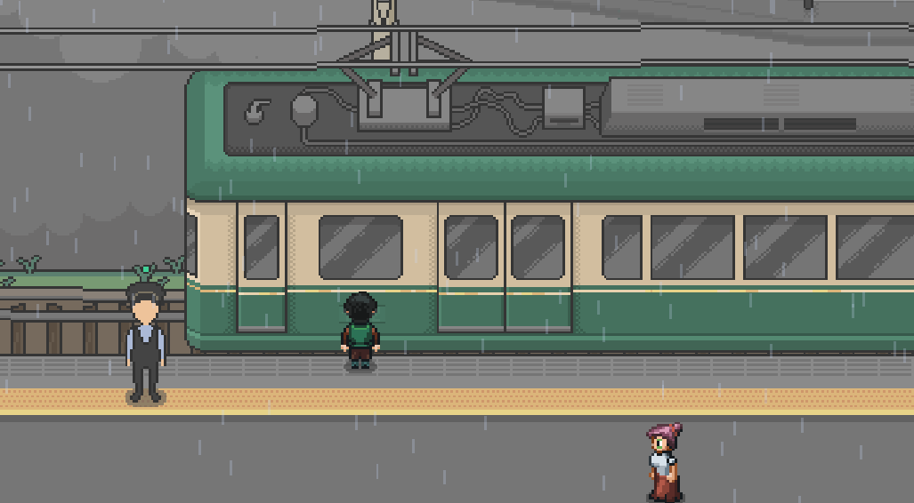

# 🎮 **Enoden: Una Aventura de Exploración en Tren** 🚂

¡Bienvenido al repositorio oficial del videojuego **Enoden**! Este proyecto forma parte de mi **Trabajo de Fin de Grado (TFG)** y está diseñado para ofrecer una experiencia inmersiva en un mundo inspirado en las estaciones de tren de Japón. 🌏✨

---

## 📖 **Descripción del proyecto**

**Enoden** es un videojuego de exploración ambientado en una estación de tren japonesa donde el jugador puede:
- Completar **misiones** relacionadas con la cultura y el entorno ferroviario. 🗺️
- Interactuar con NPCs y explorar mapas detallados. 🤝
- Evitar enemigos como ratas 🐀 y recolectar objetos únicos como plumas mágicas. 🪶

El juego combina elementos de exploración y narrativa, sin necesidad de habilidades extremas, ofreciendo una experiencia relajante pero emocionante.

---

## 🛠️ **Características principales**

- 🎨 **Estilo visual:** Inspirado en las estaciones reales de **Gokurakuji** y **Hase**, con gráficos retro creados en Aseprite.
- 🎧 **Música y sonido:** Una banda sonora envolvente diseñada en FL Studio, con efectos de sonido dinámicos.
- 🐭 **Enemigos dinámicos:** Ratas que se mueven en todas direcciones y presentan un reto moderado.
- 🚂 **Misiones únicas:** 
  - Recolectar basura y sumar puntos. 🗑️
  - Eliminar ratas en el tercer nivel para completar la misión final. ⚔️
- 🌟 **Plataforma:** Exclusivo para Windows.

---

## 📷 **Capturas de pantalla**

> *¡Pronto subiré imágenes destacadas del juego!* 📸
> ### Explorando el mapa


---

## 🚀 **Cómo jugar**

### **Requisitos del sistema**
- **Sistema Operativo:** Windows.
- **Java:** Versión 17 o superior.
- **RAM:** Al menos 2 GB.

### **Instalación**
1. Descarga el archivo **Enoden.jar** desde la sección [Releases](https://github.com/tu-usuario/tu-repositorio/releases).
2. Asegúrate de tener Java instalado en tu ordenador. [Descargar Java](https://www.java.com/es/download/)
3. Ejecuta el archivo JAR:
   ```bash
   java -jar Enoden.jar
